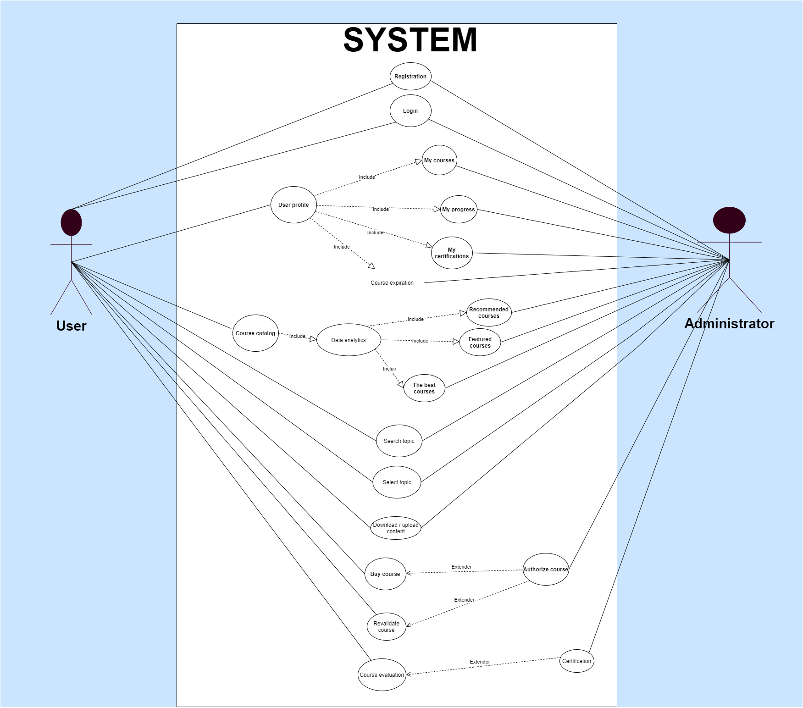
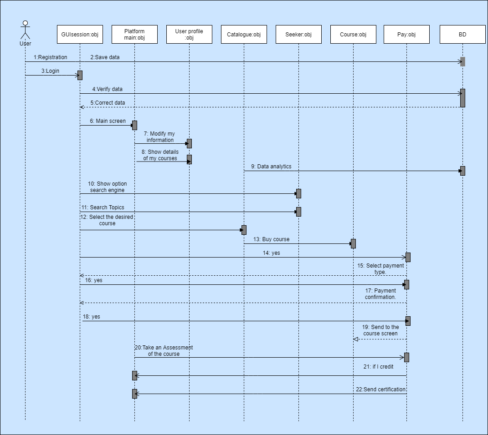
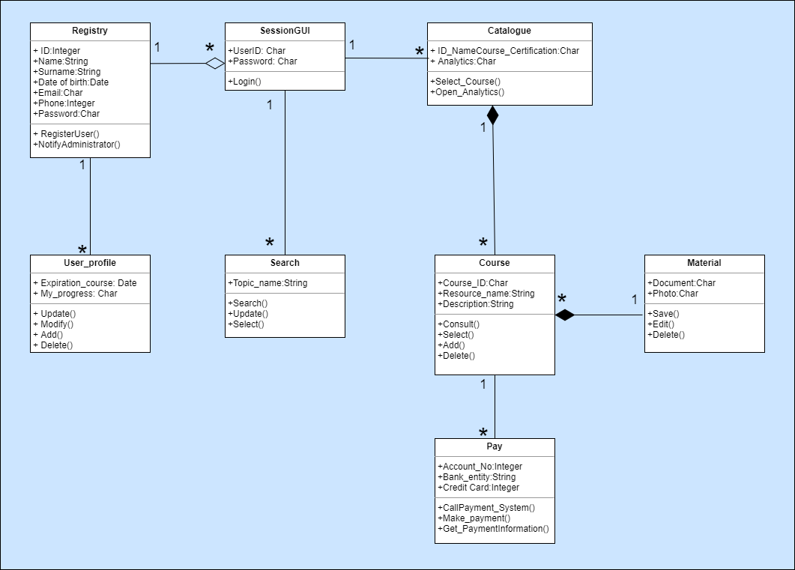
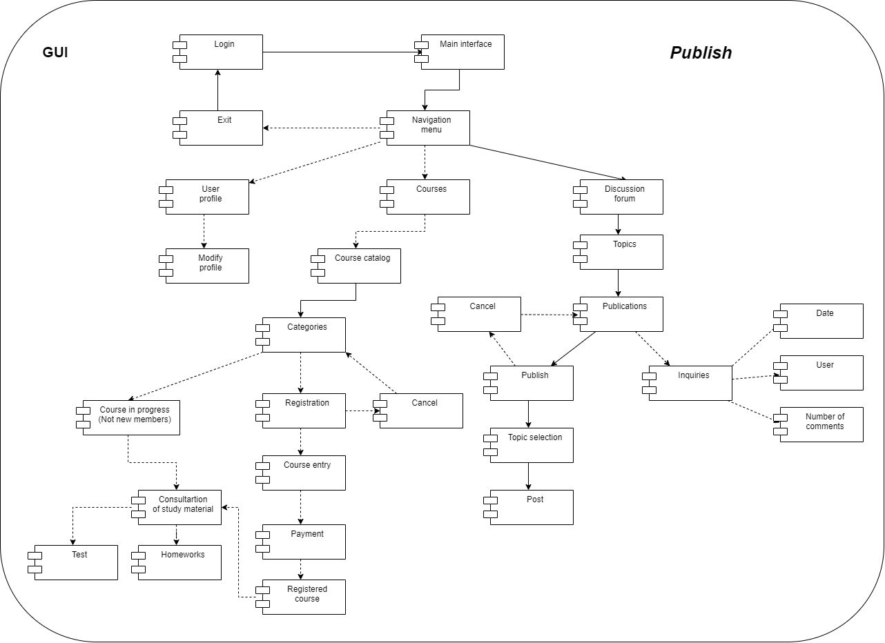
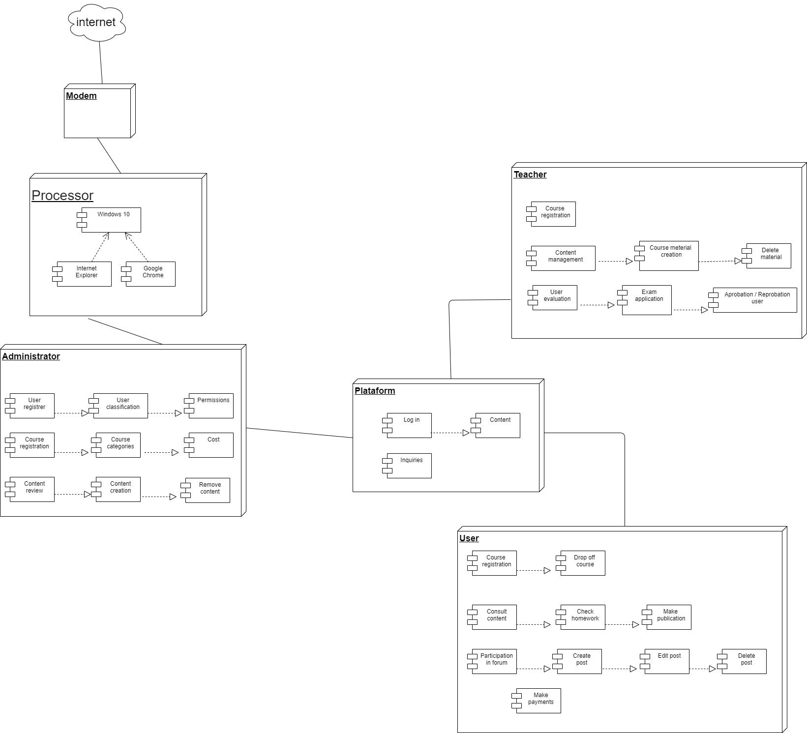

# **Introduction.**
-----
## 🏆**A1.1 Learning activity.**
Requirements modeling through UML diagrams

✏️ **Developing.**

1. Based on each of the user and system requirements established above for the case study, write the requested modeling diagrams:

* A diagram that contains the relationships between the different use cases, only for the scenario in which the user interacts with the system using the main or central functions according to each case study. (Include at least 5 elements of the diagram).

* The sequence diagram that explains the communication between the different GUIs for the use cases of the previous point, considering that the user has already successfully entered the system. (Include at least 5 elements of the diagram).

* The class diagrams for the objects to be instantiated, for the aforementioned points. (Include at least 5 elements of the diagram).

* A package diagram containing the component diagrams and the relationships between the database, user interfaces, drivers, or middle layers - middleware. (Include at least 3 elements of the diagram).

* The distribution diagrams representing the physical structure of the system such as physical infrastructure, networks, storage and web servers, firewall, mobile devices or any other physical resource that will be part of the system. (Include at least 3 elements of the diagram).

| **Integrants** | **Conclusion** |
| --- | --- |
|Acosta Noriega Saul Eduardo |These diagrams will help us a lot when programming since then we will already have a notion of what to do.
|Garza Aguilar Sergio Alberto|The elaboration of these diagrams has clarified the opportunities and accesses that each role will have within the system, showing an exploration of the different paths that they will have to take, as a visual support it is possible to make the structure of the platform known and the accesses that each one will have in case of wanting to carry out a certain action, it is important that it must be clear and understandable for those who do not have a technical language or previous knowledge, as developers it is also a support tool to focus the same vision of the platform .
|Hernández Fernández Diana  |The practice helped us to make the necessary diagrams of which with the past tasks we had knowledge of the elements that each one must carry and that will be of great help during the development of the platform according to the case study "Courses and certifications" .
|Zazueta Lopez Diana |This work helped me to better understand how the system will work in more detail our case study of courses and certifications, but it also made it difficult for me to know how some diagrams were made, but by watching some videos and reading, I clarified my doubts.  These diagrams are extremely important as they will later help us to carry out the development of this program.

---
## 💣***Rubric.***

| **Criterios**| **Description** |Score |
| --- | --- |--- |
Instructions|Is each of the points indicated in the instructions section fulfilled?|10
|Growth|Was each of the points requested within the development of the activity answered?|60
|Demonstration|Does the student present himself during the explanation of the functionality of the activity?|20
|Conclusions|Is a personal opinion of the activity included for each of the team members?|10

[Go to GitHub 🏠](https://github.com/DianaHFer/Analisis-avanzado-de-software)
