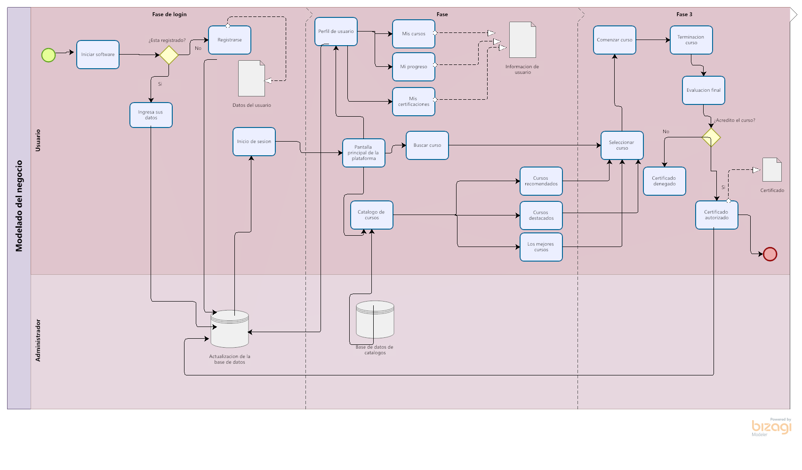

# ***Inicio del proyecto.***
## 🏆 **C1.1 Reto en clase**
### **Definición de objetivo general y los especificos, asi como el modelado del negocio.**
___

# ✏️**Desarrollo**

### **Objetivo general.**

🔶  Desarrolla una plataforma en línea para la implementación de cursos,generandole al usuario
mayor facilidad para la adquisición de conocimientos necesarios en su entorno de trabajo según su área,siendo completado exitosamente se le otorgara un comprobante
de certificación.

### **Objetivos especificos.**

🔹  Generar actualizaciones cada semana de los cursos,mostrando los más utilizados y aquellos recomendados según el perfil del usuario.

🔹  Conseguir un 10% de incremento en las inscripciones de usuarios a los cursos presentados en la plataforma cada bimestre.

🔹Cuantificar las visitas diarias de usuarios en la plataforma para observar y analizar el impacto que va generando desde su desarrollo.
___

### **Modelado de negocio según el caso de uso "Cursos y Certificaciones".**

## [**📸Imagen completa del modelo de negocio.**](https://github.com/DianaHFer/Analisis-avanzado-de-software/blob/main/Documents%20U1/Images/MN.png)

[***Ir a mi repositorio de Github.***](https://github.com/DianaHFer/Analisis-avanzado-de-software)
