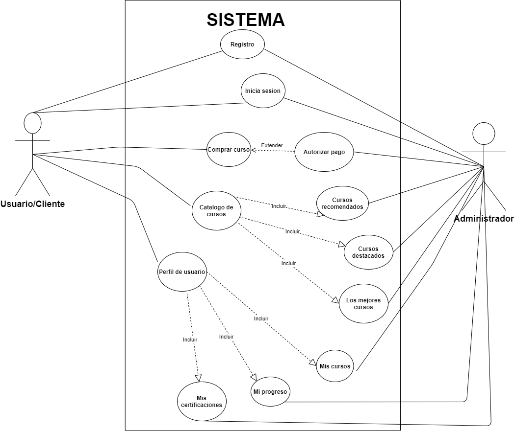
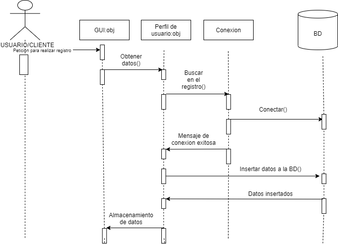
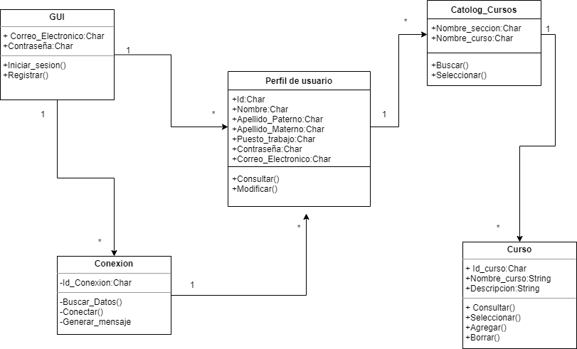

# ***Inicio del proyecto.*** 
 ## 🏆**C1.4 Reto en clase.** 
### **Modelado de requisitos a través de diagramas estructurales para el caso de estudio "Cursos y certificaciones".** 

---
### ***Diagrama de caso de uso basado.***

### ***Diagrama de secuencia para el registro de un usuario.***

### ***Diagrama de clases.***

[***Ir a mi repositorio de Github.***](https://github.com/DianaHFer/Analisis-avanzado-de-software)

