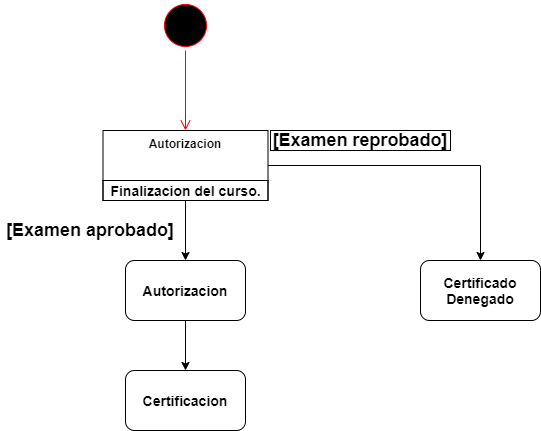
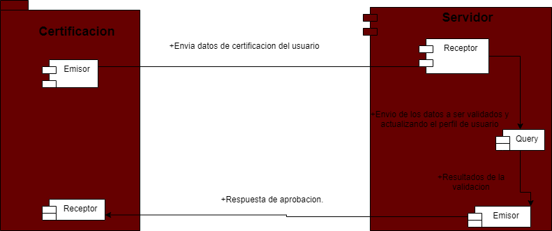
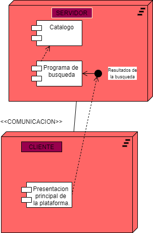

# ***Inicio del proyecto.*** 
 ## 🏆**C1.5 Reto en clase.** 
### **Modelado de requisitos a través de diagramas de comportamiento para el caso de estudio "Cursos y certificaciones".** 
---
### **Diagrama de estados.**

###### ***Este diagrama se basa en la autorización de un certificado, este proceso se hara cuando el usuario finalice los cursos, aqui se comprobara si el examen fue aprobado o reprobado,según sea el caso se realizara una accion.***
---
### **Diagrama de componentes.**

###### ***En este diagrama se muestra la interacción entre el cliente y servidor al momento de mandar los datos de certificación del usuario y asi poder generar las actualizaciones necesarios en su progreso.***
---
### **Diagrama de distribución.**

###### ***Este diagrama es la representación de la distribución de un sistema cliente – servidor,la plataforma nos debe mostrar los recursos del servidor a los que el usuario debe tener acceso, como por ejemplo el programa de búsqueda, al utilizar dicho programa, ocurre una conexión con el servidor quien procesa y hace un procesamiento de los datos y entonces retorna un resultado para dicha búsqueda.***

---

[***Ir a mi repositorio de Github.***](https://github.com/DianaHFer/Analisis-avanzado-de-software)
