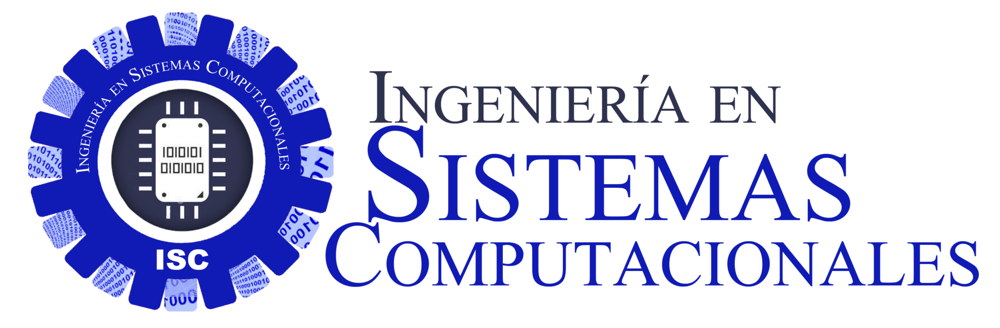

##    Tecnológico Nacional de México

##  Instituto Tecnológico de Tijuana
##       Subdirección Académica
## Departamento de Sistemas y Computación
## Ingeniería en Sistemas Computacionales

___

## **Semestre:** 
Enero-Junio2021
## **Materia**
## Análisis Avanzado de Software.
## 📝 **Nombre del alumno:**
### Hernández Fernández Diana   #18210485
## **Docente:**
### Enrique Alvarez Jaime Leonardo.

## **Nombre del equipo**: ___Disae___ 

---

<table>

<thead>

<tr>

<th>Número de control</th>

<th>Nombre del integrante</th>

<th>3 fortalezas tecnológicas</th>

<th>3 debilidades tecnológicas</th>

</tr>

</thead>

<tbody>

<tr>

<td>16212529</td>

<td>Acosta Noriega Saul Eduardo</td>

<td>C++, C#, Python </td>

<td>Java, JavaScript, SQL </td>

</tr>

<tr>

<td>15211700</td>

<td>Garza Aguilar Sergio Alberto </td>

<td>C#, HTML,PHP</td>

<td>Java,Python,JavaScript </td>

</tr>

<tr>

<td>18210485</td>

<td>Hernández Fernández Diana </td>

<td>C#,C++,SQL</td>

<td>Python,Java,HTML</td>

</tr>

<tr>

<td>18210546</td>

<td>Zazueta Lopez Diana </td>

<td>C#, C++, SQL</td>

<td>JavaScript,Python,PHP </td>

</tr>

</tbody>

</table>

---

# Prácticas U1📝

 ##  - ⌛️[C0.1 IntegrarEquiposdeTrabajo.](https://github.com/DianaHFer/Analisis-avanzado-de-software/blob/main/U1/C0.1_IntegrarEquiposdeTrabajo_HernandezDiana.md#)
 ##  - ⌛️[C0.2 Tipo de sistema de información.](https://github.com/DianaHFer/Analisis-avanzado-de-software/blob/main/U1/C0.2_Tipo%20de%20sistema%20de%20informacion_HernandezDiana.md)
----

   

