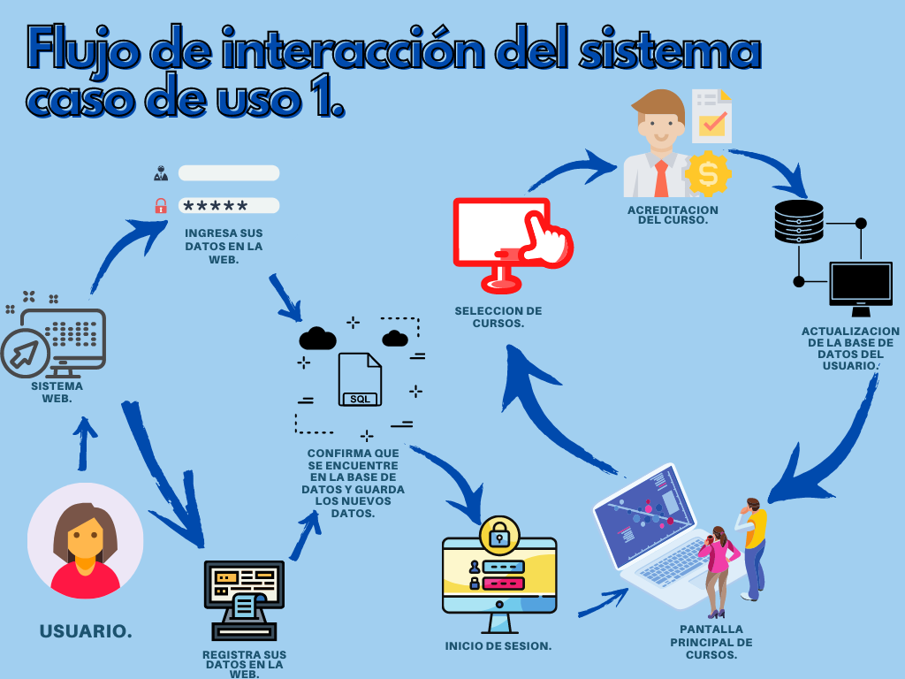

# ***Tipo de Sistema de información***

## 🏆 **C0.2 Reto en clase.**

Investigación sobre el tipo de sistema que involucra el caso de estudio a desarrollar.
___
### **Caso de estudio 1: Cursos y certificaciones.**

  

**“The vid of knowledge”** es una empresa ofrece herramientas tecnologías basadas en la administración y conservación del conocimiento, sin embargo debido a la gran competitividad del mercado y a las condiciones actuales y cambiantes, esta considerando proveer una aplicación referente a “cursos y certificaciones” por medio de una plataforma en línea, a un nivel de calidad y costo que le permita obtener mayores ganancias. 
A través de un estudio de mercado sobre otras plataformas similares,  se observa que entre las características que se debe ofrecer dentro de este modelo de negocio están los siguientes:
1. Ofrecer a los usuarios una plataforma que este disponible en todo momento, que sea fácil de utilizar y atractiva, así como garantice seguridad de la información que ahí se registre .
2. Ofrecer a los usuarios inscribirse a un cualquier curso a través de un catalogo, y/o un mapa de ruta de cursos basado en un perfil establecido.
3. Permitir que los cursos que se publiquen y ofrezcan puedan ser creados utilizando distintos formatos tales como son videos o presentaciones, y separadas por tópicos con un limite máximo de tamaño y duración.
4. Ofrecer al usuario los avances logrados por cada curso, y al ser completado a través de una evaluación exitosa, otorgue un comprobando de certificación.
5. Ofrecer analítica de datos sobre los cursos que son mas solicitados, los cursos a los cuales los usuarios se enrolaron y completaron, así como los usuarios a los cuales su certificación esta por expirar o expiro.

_________

## **Sistema seleccionado para el caso de uso .**

  

  

Sistema | Terminología | Objetivos por los cuales son creados |
---|---|---|
**Sistemas de administración del conocimiento**|KMS Knowledge Managment Systems|Estos permiten administrar los procesos para capturar y aplicar el conocimiento y la experiencia.|
|||
## **Justificación.**
El caso de estudio esta referido al sistema de administración del conocimiento debido a que sera de ayuda para la gestión de toda la información y el conocimiento que hay en la empresa para poder sacar un buen partido de ella,sera de una buena herramienta para llevar el control de la información y la organización de la documentación, de la cual podran tener acceso los empleados para reforzar los temas adquiridos durante el tiempo de las operaciones cotidianas que manejen, ofreciendole así herramientas para la administración, entrega, seguimiento y evaluación de los diversos tipos de aprendizaje y capacitación de los empleados con  clases e instrucciones a través de la Web, así como aprendizaje en grupo en foros en línea y en salas de conversación.

Es importante que la empresa actualice a cada uno de sus empleados teniendo la capacidad de identificar, recopilar, almacenar, evaluar y compartir toda la información valiosa para darle un mejor servicio al cliente.

### **Características que debe tener el caso de estudio para cumplir con el tipo de sistema.**

  

  

  El caso de estudio debera cumplir con las siguientes características para que pueda pertenecer al sistema de administración de conocimiento.

  1. Tecnología adecuada que permita la creación, gestión y compartición de documentos con un formato determinado.
  2. Desarrollo de herramientas sociales dentro de la empresa para sacar un mayor aprovechamiento del sistema KM.
  3. Un proposito que distinga a la empresa.
  4. Trabajadores activos con conocimientos previos para poder llevar exitosamente el ciclo de vida del sistema.
  5. Contar con un encargado para el manejo del sistema para que influya positivamente en la obtención de buenos resultados en la empresa.
  6. Contar con un control de audiencia, ya que no todos los conocimientos deben estar disponibles para el público, solo para personal registrado por la empresa.
  7. Mantener su identidad de marca en todos sus activos en línea (su página web, su producto y su centro de ayuda)

  ## **Flujo de interacción del sistema.**

  