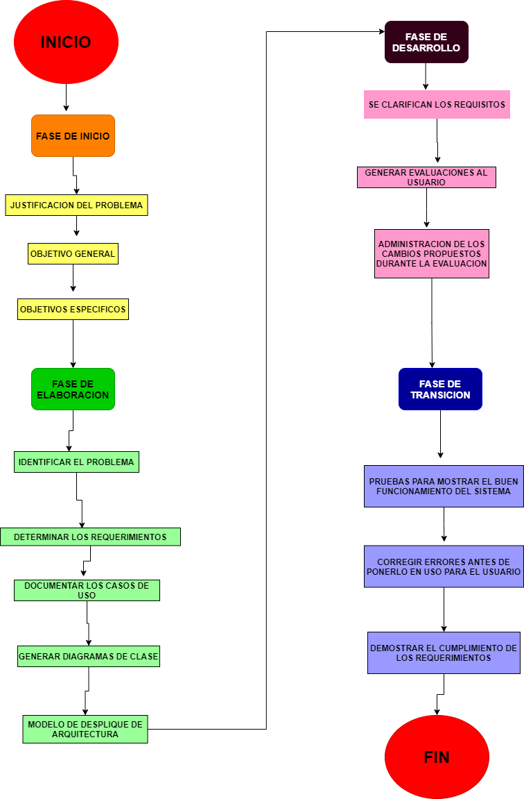

# ***Diagrama de flujo sobre el proceso de desarrollo***

## 🏆 **C0.3 Reto en clase.**

### **Proceso de desarrollo y flujo de trabajo de la metodología a seguir.**

---
### Diagrama de flujo que contiene la secuencia a seguir durante el ciclo de desarrollo del software, explicando que actividades se involucrarían en cada parte del flujo según la metodología de RUP.
___
En este proceso se describen tres perspectivas:

**1. Dinámica.**

En donde se describen las siguientes fases.
1. Inicio.
2. Elaboración.
3. Desarrollo o construcción.
4. Transición.
5. Producción
___
**2. Estática.**

Se enfoca en las actividades llamados **flujos de trabajo**
1. Modelado del negocio.
2. Requerimientos.
3. Análisis y diseño.
4. Implementación.
5. Pruebas.
6. Despliegue.
7. Administración de la configuración y del cambio.
8. Administración del proyecto
9. Entorno.
___
**3. Práctica.**

1. Desarrollo de software de manera iterativa.
2. Gestión de requerimientos.
3. Usar arquitecturas basadas en componentes.
4. Software modelado visualmente.
5. Verificar la calidad de software.
6. Controlar los cambios al software.
___

# **Flujo de proceso**

[***Ir a mi repositorio de Github.***](https://github.com/DianaHFer/Analisis-avanzado-de-software)